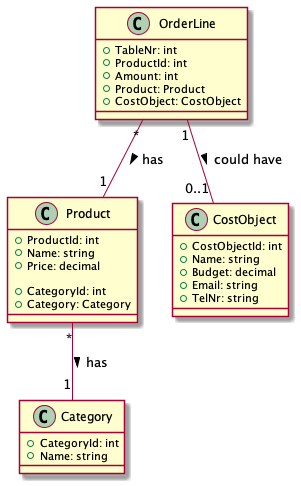

# Opdrachten Les 3 - Database

Het verbinden, bevragen, en updaten van een database kan relatief eenvoudig met Dapper.
Dapper wordt ook wel een Micro ORM genoemd.

* [Dapper Getting Started](https://dapper-tutorial.net/dapper)
* [Learn Dapper](https://www.learndapper.com/)

Tip: schrijf eerst je SQL queries en probeer deze uit, voordat je ze gebruik i.c.m. Dapper. Dan kun je al een hoop fouten voorkomen.
Tip: Als je in Rider (van JetBrains) verbinding maakt met je Database dan helpt Rider je met code completion voor SQL en als je fouten hebt in je SQL code laat hij dit ook zien, 
zelfs als de SQL tussen C# code staat. Visual Studio heeft bij mijn weten deze hulp (helaas) niet.  
Tip: bekijk de voorbeelden (zie directory Examples/Lesson3).

## Opdracht 1 NHLStenden Café

Het NHLStenden Café wil een webapplicatie, waarmee het mogelijk is om bestellingen te registeren.
 
Er zijn al een aantal klassen aangemaakt (deze mag je gebruiken, hoeft niet per se), namelijk:
* `Product` o.a. drankjes die besteld kunnen worden in het café.
* `Category` ieder drankje heeft 1 category, dus `Product` heeft een verwijzing (associatie/reference) naar `Category` (en de database dus een foreign key).

    
  
* Maak een database aan met de volgende naam: `Cafe`, voer het `MysqlCafe.sql` script uit, deze staat in de directory `Exercises.Tests`.
`MysqlCafe.sql` niet aanpassen, dan werken de test niet meer!
Deze maakt tabellen die overeenkomen met de klassen in de `Models` map en vult de database met dummy data.

* `DbUtils.GetDbConnection()` maakt verbinding met de Database, deze haalt de connectiestring uit appsettings.json. 
Controleer of je connectionstring klopt met jouw situatie (mocht deze anders dan anders zijn).
* De test kunnen niet bij de appsettings.json bestanden!! Daarom is in de klasse `DbUtils` de connectionstring ook hard gecodeerd, deze staat in de directory `Exercises.Tests`). **Controleer of de connectiostring ook hier klopt met jouw situatie!** 

Op [connectionstrings](https://www.connectionstrings.com/) kan je vinden hoe een connectiestring is opgebouwd.
Hierbij is het belangrijk te realiseren dat je verbinding maakt met een database m.b.v. een driver. De driver regelt de communicatie tussen de database en C# code.
Belangrijk om te realiseren is dat je vaak een .NET driver nodig bent om vanuit C# te werken met je database. 
Iedere driver heeft een specifieke connectiestring. Vaak is de opbouw te vinden in de documentatie van de driver die je gebruikt en op [connectionstrings](https://www.connectionstrings.com/).  

De driver die je nodig bent voor MySQL wordt normaal gesproken geïnstalleerd met NuGet, zie [NuGet - Mysql.Data](https://www.nuget.org/packages/MySql.Data/). Dit is al voor je gedaan.

Het installeren van de driver alsook het maken van een conenctionstring en verbinding zal je zelf moeten doen voor de eindopdracht (bruiden website).

Het is niet de bedoeling om in een Page Model (cshtml.cs file) rechtstreeks verbinding te maken met de database en query's uit te voeren.
We maken een speciale klasse `CostRepository`, waarin we alle database gerelateerd methoden zetten.
Voor iedere methode in de repository is een test beschikbaar. 
Implementeer de volgende methoden in `CostRepository` m.b.v. `Dapper`:
* `public List<CostObject> GetAll()`: haalt alle CostObjecten op.
* `public Get(int costObjectId)`: haalt 1 CostObject op.
* `public CostObject Delete(int costObjectId)`: verwijderen van CostObject, dit kan alleen als er geen afhankelijkheden meer zijn (als deze er wel zijn throw een exception, zie test).
* `CostObject Update(CostObject costObject)`: aanpassen/updaten van `CostObject`.
* `CostObject Insert(CostObject costObject)`: toevoegen van `CostObject`.
* `TotalPrice GetTotalBillPrice(int costObjectId)`: haalt de rekening op. Maak een SQL-query die deze gegevens laat zien. Je kan het `TotalPrice` object vullen met 1 Query, SQL Hints: GROUP BY, arregatie functies (SUM), JOINS.
* `TotalPrice GetTotalBillPriceMultiMapping(int costObjectId)`: haalt de rekening op. Nu gaan is het de bedoeling om [Query Multi Map](multiple-mapping-d36c637d14fa) te gebruiken met Dapper. In het `map:` argument (parameter) kan je dan het Total berekening maken!
Vul de `CostObject` en de gerelateerde klassen `OrderLine` en `Product`.   

De test  voor deze `CostRepository` zijn te vinden in `CostObjectRepositoryTests.cs` bestand.

De volgende pagina's dienen gerealiseerd te worden:
* `Overview.cshtml` - Read - Op deze pagina staat een lijst van alle `CostObjecten`. 
Deze pagina is al gemaakt. Je moet zelf nog knoppen/link toevoegen om de volgende pagina's aan te roepen: `Edit.cshtml`, `Create.cshtml` en `Delete.cshtml`. 

Maak de volgende pagina's:
* `Create.cshtml` - Maak pagina waarop een `CostObject` aangemaakt kan worden. Valideer of de input correct is, m.b.v. [Model Binding & Validation](https://www.learnrazorpages.com/razor-pages/validation). 

* `Edit.cshtml` - Pas een `CostObject` aan. Ook hier is [Model Binding & Validation](https://www.learnrazorpages.com/razor-pages/validation) van belang. 

* `Delete.cshtml` - Verwijder een bestaand `CostObject`. Nadat een `CostObject` is verwijderd stuur je de gebruiker terug naar `Overview.cshtml`.

Voor de webpagina's zelf zijn er geen test. Er zijn alleen test op database niveau. 
Het testen van webpagina's is zeker mogelijk, echter dan moet ik zo precies specificeren hoe de HTML-structuur eruit ziet dat dit lastig is (zoals in de tests van week 0 en 1).
Test dus handmatig of de webpagina's naar behoren werken.  

## Opdracht 2 NHLStenden café bestel pagina

Het NHLStenden café wil een simpele webapplicatie, waarmee het mogelijk is om bestellingen te registeren.
Er zijn 10 tafels. De Ober (`Ober.cshtml`) selecteert een tafel. 
Als er al bestellingen zijn gedaan voor deze tafel worden deze bestellingen getoond.

Een Ober kan vervolgens een `Category` selecteren (Frisdrank, Bier, etc). 
De producten in deze categorie worden getoond en kunnen worden toegevoegd aan de bestelling (order_line)
van deze tafel. Als een product wordt toegevoegd komt deze in de bestellijst te staan. 
Stond een product er al in dan wordt het aantal met 1 verhoogt. 

Omdat het een slecht idee is om de database code rechtstreeks in de Page Model te plaatsen wordt er meestal een speciale klasse gemaakt 
die methoden bevat om met de database te communiceren. Dit wordt vaak een repository (magazijn/opslagplaats) genoemd.

Implementeer de volgende methoden van de repository en de webpagina `Ober.cshtml` zou moeten werken.
De Test voor de repository staan in `OrderRepositoryTest.cs` in de directory `Exercises.Test`.

Voordat je kan beginnen moet je eerst een database maken. Vervolgens kan je het `MysqlCafe.sql` script uitvoeren, deze staat in de map `Exercises.Test`.
Dit bestand mag je niet aanpassen omdat de test anders niet meer werken.  
Dit SQL-script maakt de tabellen aan voor deze opdracht en vult deze met Dummy Data.

Maak de volgende methoden van de `OrderRepository`:
* `public List<Category> GetCategories()`: Deze retourneert (return) een lijst van alle categorieën (`Category`) gesorteerd op naam.
* `public List<Product> GetProducts(int categoryId)`: Deze retourneert een lijst `Product`en die bij een bepaalde category behoren (categoryId).
* `public Category GetCategoryByName(string categoryName)`: Deze retourneert 1 category die een de naam `categoryName` heeft. Als er niets gevonden wordt moet er null worden geretourneerd. 
* `public void AddOrder(int tableNr, int productId)`: Voegt een product (`productId`) aan een order (`OrderLine`) toe voor een tafel (`tableNr`). Indien een product al eerder is besteld moet het aantal (`Amount`) verhoogt worden met 1, anders gewoon toevoegen met `Amount = 1`.
* `public void Pay(int tableNr)`: Een tafel betaald de rekening. Alle orders (`OrderLine`) moeten verwijderd worden voor de betreffende tafel (`tafelNr`).

Het is mogelijk om gegevens uit meerdere tabellen op twee manieren op te halen (net als in de eerste opdracht):
* `public List<TableOrderViewModel> GetTableOrders(int tableNr)`: Haalt de order van een tafel `tableNr` op. Het resultaat van 1 `OrderLine` en de gerelateerde objecten wordt opgeslagen in de klasse `TableOrderViewModel`. Dit kan je implementeren met 1 Query en een aantal Joins. Sorteer op `Category.Name` gevolgd door `Product.Name`.
* `public List<OrderLine> GetTableOrdersWithRelationships(int tableNr)`: Je kan objecten die een relatie hebben ophalen m.b.v. de technieken zoals beschreven staat in [multi mapping](https://medium.com/dapper-net/multiple-mapping-d36c637d14fa) en [learndapper - relationships](https://www.learndapper.com/relationships). Sorteer op `Category.Name` gevolgd door `Product.Name`.

Optionele opdracht (geen test), pas de `Ober.cshtml` aan: 
* Zorg ervoor dat je een orderLine ook kunt verwijderen (Amount verlagen met 1 of verwijderen indien Amount 0 is).
* Het aantal producten dat je wilt bestellen kunt opgeven in plaats van verhoog & verlaag knop.

## Opdracht 3 Bruidenwebsite

Hieronder volgt een stappenplan voor het maken van de database gerelateerde pagina's van de bruidenwebsite.

* Maak een database ontwerp voor de bruidenwebsite.
* Maak een database en tabellen aan die overeenkomen met de klassen (Model).
* Vul je database met dummy data
* Maak je Model klassen 
* Maak een Repository 
* Maak je Razor Pages (CRUD en eventuele andere functionaliteit). 

Heel veel succes met het afronden van je eindopdracht (bruidenwebsite). Begin week 6 zal deze worden beoordeeld in een assessment, waarin je uitlegt wat je hebt gemaakt. Bij deze beoordeling is het belangrijk dat je de toegepaste technieken/concepten kan uitleggen. 
Het beoordelingsmodel staat op Blackboard. 
  
